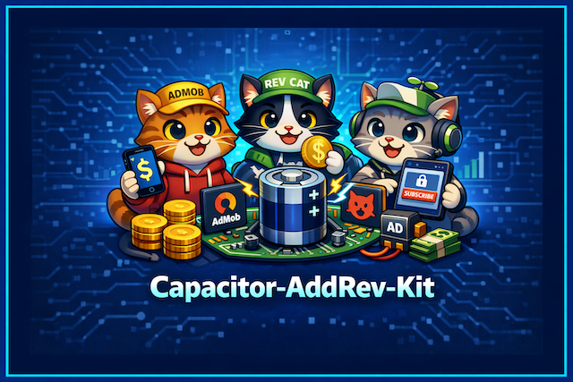

# Capacitor AdRev Kit



Boilerplate Capacitor native shell for wrapping any remote web application inside a Capacitor WebView for iOS (and optionally Android). Out-of-the-box paywall and ads integration using Revenue Cat and AdMob.

## Setup for Your App
Edit `capacitor.config.ts` and set:
- REMOTE_URL to your deployed web app origin (must be https in production).
- server.allowNavigation domain list accordingly.

## Install & Initialize
### Node version
This project requires Node **20.19.5**. The repository includes an `.nvmrc` file so you can simply run:

```bash
nvm use
```

If `nvm` isn’t installed, follow <https://github.com/nvm-sh/nvm#installing-and-updating> first. Running any Capacitor CLI command with an older Node version will exit with `The Capacitor CLI requires NodeJS >=20.0.0`.

### Dependencies & Capacitor setup
```bash
npm install
## If you are creating a new Capacitor project from scratch, run:
```bash
npx cap init <app-name> <app-id> --web-dir=<web-folder> --npm-client=npm
```
For this repository, you do NOT need to run `cap init` again. Just run:
```bash
npm install
npx cap add ios
```
npx cap add ios
```

(If `ios` folder already exists you can skip add step.)

## Development


### App Settings Management
First, copy the example settings file to create your actual app settings:

```bash
cp src/app.settings.example.ts src/app.settings.ts
```

Edit `src/app.settings.ts` to match your app's configuration (name, IDs, URLs, AdMob and RevenueCat keys, etc.).

Before building or pushing to Xcode, run:

```bash
node update-app-settings.js
```

This script will update all relevant files (native configs, web assets) with the current settings from `src/app.settings.ts`.


**Workflow:**
- Copy and edit `src/app.settings.ts` as needed
- Run `node update-app-settings.js`
- Build and archive from Xcode as usual

This ensures all settings are consistent and up-to-date across your project.

## Open in Xcode
```bash
npm run ios
```

Then build & archive from Xcode.

## Features
- Remote web app wrapper for iOS (Android optional)
- Built-in AdMob integration
- Built-in RevenueCat paywall/subscription logic
- Offline detection modal
- Easily customizable for any web app

## Optional: Add a local fallback
If you later want offline capability, build static assets into a folder (e.g. `web`) and change `webDir` plus remove the `server.url` property for production.

## AdMob (later)
Add: `npm install @capacitor/admob` (or community plugin) and configure in native projects.

## Splash & Icons
Place source assets (1024x1024 icon, 2732x2732 splash) and run `npx @capacitor/assets generate`.
