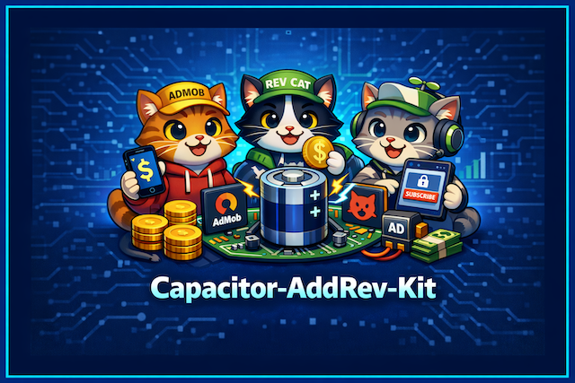

# Capacitor AdRev Kit



iOS native shell for **Capacitor AdRevKit**. A thin Capacitor wrapper that loads `https://your-remote-app.example.com` inside a native WebView and provides bridged native services: subscriptions (RevenueCat), advertising (AdMob), network status, and status bar control.

App ID: `com.AdRevKit.app`

## Architecture

There is no local front-end build. The shell points directly to the deployed web app via `capacitor.config.ts`:

```
Remote URL: https://your-remote-app.example.com
WebView ← Capacitor bridge → Native iOS plugins
```

When a new version of `app` is deployed, the app reflects it automatically on next launch.

## Native Plugins

| Plugin                            | Purpose                               |
| --------------------------------- | ------------------------------------- |
| `@capacitor-community/admob`      | Interstitial / banner ads (free tier) |
| `@revenuecat/purchases-capacitor` | In-app subscriptions (premium tier)   |
| `@capacitor/network`              | Offline detection → OfflineModal      |
| `@capacitor/status-bar`           | Status bar styling                    |
| `@capacitor/app`                  | App lifecycle events                  |
| `@capacitor-community/media`      | Media access (future)                 |

## Project Structure

```
capacitor/
├── src/
│   ├── boot.ts            # Capacitor init sequence
│   ├── auth-bridge.ts     # Passes auth tokens between WebView and native
│   ├── revenuecat.ts      # RevenueCat purchase flows
│   ├── network-status.ts  # Network monitoring → fires offline event
│   ├── AdFlow.tsx         # AdMob ad display logic
│   └── OfflineModal.tsx   # Shown when network is unavailable
├── ios/                   # Xcode project (generated by Capacitor)
├── www/                   # Minimal blank web dir (required by Capacitor)
├── blank/                 # Static fallback placeholder
├── capacitor.config.ts    # Remote URL, plugin class list, iOS config
├── safe-area.css          # Safe area inset handling for notch/island devices
├── package.json
└── tsconfig.json
```

## Requirements

- Node >= 20.0.0 (Capacitor CLI requirement)
- Xcode (latest stable) for iOS builds
- Apple Developer account for signing and App Store distribution

## Setup

```bash
# Use correct Node version
nvm use   # reads .nvmrc -> Node 20.19.5

# Install dependencies
npm install

# Create local env config
cp .env.example .env

# Apply account keys to iOS Info.plist
npm run env:apply

# If ios/ folder does not yet exist
npx cap add ios
```

## Sync & Open in Xcode

After any native config change or plugin addition:

```bash
npm run env:apply
npm run cap:sync   # npx cap sync
npm run ios        # npx cap open ios
```

Then build and archive from Xcode for TestFlight / App Store submission.

## Configuration

Use `.env` for environment-specific values (local/dev/staging/prod):

```env
CAP_SERVER_URL=https://your-remote-app.example.com
CAP_ALLOW_NAVIGATION=your-remote-app.example.com
IOS_REVENUECAT_API_KEY=appl_replace_me
RC_ENTITLEMENT=no_ads
IOS_ADMOB_APP_ID=ca-app-pub-replace_me~replace_me
```

Then run:

```bash
npm run env:apply
```

Where values are used:

- Wrapped website + allow-list hostnames: `capacitor.config.ts`
- RevenueCat native API key: `ios/App/App/Info.plist` (`RevenueCatAPIKey`) via `npm run env:apply`
- AdMob app id: `ios/App/App/Info.plist` (`GADApplicationIdentifier`) via `npm run env:apply`

`Info.plist` is committed with placeholder values only.

Local workflow:

- Keep real IDs only in `.env`.
- Run `npm run env:apply` before syncing/opening iOS to inject local values.
- Do not commit `ios/App/App/Info.plist` after injection if it contains real IDs.

Before pushing, verify:

```bash
git diff -- ios/App/App/Info.plist
```

If real IDs appear in that diff, discard plist changes before commit:

```bash
git restore -- ios/App/App/Info.plist
```

The wrapped URL still comes from Capacitor config:

```typescript
const REMOTE_URL =
  process.env.CAP_SERVER_URL || "https://your-remote-app.example.com";
```

`allowNavigation` is locked to `your-remote-app.example.com`. Add any additional domains (e.g. OAuth redirect hosts) there before syncing.

## Splash Screen & Icons

Source assets required:

- App icon: 1024x1024 px PNG (no alpha)
- Splash screen: 2732x2732 px PNG

Generate all platform sizes:

```bash
npx @capacitor/assets generate
```

## Subscription Flow

RevenueCat is initialised in `src/revenuecat.ts`. Purchase events post back to the `app` server to update the user's `subscriptionTier` in the database, making premium content available immediately without requiring a re-login.
